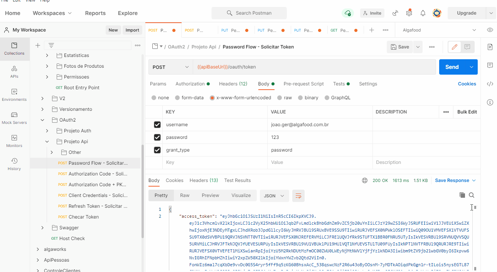

# Especialista Spring REST da Algaworks

Descrição: Treinamento imersivo focado em back-end, do básico ao ultra avançado sobre REST APIs com Spring .

Link: 🔗[Curso Especialista Spring REST by Algaworks](https://www.algaworks.com/curso/especialista-spring-rest)

## 💻 Projeto do curso

AlgaFood - Projeto para gerenciamento de restaurantes incluindo cadastros de cozinhas, pedidos, produtos, fotos de produtos, formas de pagamento, usuários, grupos, permissões, cidades e estados. Envolve autenticação de usuários com restrição de enpoints com base nas permissões do usuário.

## :camera: Demonstração




## :rocket: Conceitos e tecnologias

✔️ Spring e Injeção de Dependências

✔️ JPA, Hibernate e Flyway

✔️ Spring Data JPA

✔️ Domain-Driven Design (DDD)

✔️ Fundamentos avançados de REST com Spring

✔️ Validações com Bean Validation

✔️ Tratamento e modelagem de erros da API

✔️ Testes de integração (REST Assured, JUnit, AssertJ e Maven Failsafe Plugin)

✔️ Boas práticas e modelagem avançada de APIs

✔️ Modelagem de projeções, pesquisas e relatórios (JsonView, Squiggly e Jasper Reports)

✔️ Upload e download de arquivos (Local e Amazon S3)

✔️ Envio de e-mails transacionais (Apache FreeMarker)

✔️ Cache de HTTP (ETags)

✔️ Documentação com OpenAPI (Swagger e SpringFox)

✔️ HATEOAS e Discoverability

✔️ CORS e consumo de APIs com Java e JavaScript

✔️ Segurança com Spring Security, OAuth2 e JWT (Opaque Tokens e Transparent Tokens)

✔️ Cloud-native APIs

✔️ Docker, DockerHub e Docker compose

✔️ Deploy em produção na nuvem

✔️ Amazon AWS (EC2, EKS, ECS, Fargate, ELB, ECR, RDS, S3, Systems Manager Parameter Store, Certificate manager), RedisLabs e PWS

✔️ Configuração e gerenciamento de logs (Loggly)

✔️ Versionamento de APIs (Media Types e URIs)

## ⚙️ Configurações

- Ferramentas necessárias

```bash
MySQL, Redis, Amazon S3 (opcional), SendGrid / Mailtrap (opcional) e Postman
```

- Gerando um arquivo JKS com um par de chaves

```bash
$ keytool -genkeypair -alias algafood -keyalg RSA -keypass 123@algafoodprod -keystore algafood-prod.jks -storepass 123@algafoodprod -validity 3650

$ cat algafood-prod.jks | base64
```

- Para rodar a API configurar no arquivo `aplication.properties` os seguintes parâmetros

```bash
spring.datasource.url=
spring.datasource.username=
spring.datasource.password=

algafood.storage.tipo="s3 ou local"
algafood.storage.s3.id-chave-acesso=
algafood.storage.s3.chave-acesso-secreta=
algafood.storage.s3.bucket=
algafood.storage.s3.regiao=

algafood.email.impl="fake, sandbox ou smtp"
algafood.email.sandbox.destinatario="destinatario para tipo de envio sandbox"
algafood.email.remetente=
spring.mail.host=
spring.mail.port=
spring.mail.username=
spring.mail.password=

logging.loggly.token=

algafood.jwt.keystore.jks-location=
algafood.jwt.keystore.password=
algafood.jwt.keystore.keypair-alias=
```

- Para na AWS configurar os seguintes parâmetros no serviço Parameter Store

```bash
/prod/algafood-api-service/DB_HOST =
/prod/algafood-api-service/SPRING_DATASOURCE_USERNAME =
/prod/algafood-api-service/SPRING_DATASOURCE_PASSWORD =

/prod/algafood-api-service/SPRING_REDIS_HOST =
/prod/algafood-api-service/SPRING_REDIS_PORT =
/prod/algafood-api-service/SPRING_REDIS_PASSWORD =

/prod/algafood-api-service/LOGGING_LOGGLY_TOKEN =

/prod/algafood-api-service/ALGAFOOD_JWT_KEYSTORE_JKS_LOCATION =
/prod/algafood-api-service/ALGAFOOD_JWT_KEYSTORE_PASSWORD =
/prod/algafood-api-service/ALGAFOOD_JWT_KEYSTORE_KEYPAIR_ALIAS =

/prod/algafood-api-service/ALGAFOOD_STORAGE_S3_ID_CHAVE_ACESSO =
/prod/algafood-api-service/ALGAFOOD_STORAGE_S3_CHAVE_SECRETA =
/prod/algafood-api-service/ALGAFOOD_STORAGE_S3_BUCKET =
/prod/algafood-api-service/ALGAFOOD_STORAGE_S3_REGIAO =

/prod/algafood-api-service/ALGAFOOD_EMAIL_REMETENTE =
/prod/algafood-api-service/SPRING_MAIL_HOST =
/prod/algafood-api-service/SPRING_MAIL_PORT =
/prod/algafood-api-service/SPRING_MAIL_USERNAME =
/prod/algafood-api-service/SPRING_MAIL_PASSWORD =
```

## :phone: Contato

 Linkedin [https://www.linkedin.com/in/danyllo-valente-da-silva-3569b460](https://www.linkedin.com/in/danyllo-valente-da-silva-3569b460)

:postbox: E-mail [danyllo.dvs@gmail.com](danyllo.dvs@gmail.com)
